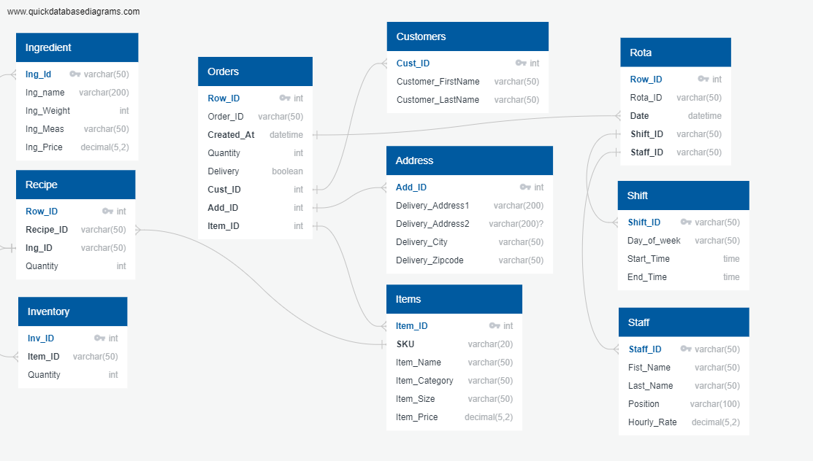

# Ben's Pizzeria


# Table of Contents

- [Objective](#objective)
- [User Story](#user-story)
- [Data Source](#data-source)
- [Stages](#stages)
- [Design](#design)
  - [Dashboard components required](#dashboard-components-required)
  - [Dashboard mockup](#dashboard-mockup)
  - [Tools Used](#tools-used)
- [Development](#development)
  - [Pseudocode](#pseudocode)
  - [Data exploration notes](#data-exploration-notes)
  - [Data cleaning](#data-cleaning)
  - [Transform the data](#transform-the-data)
  - [Create the SQL view](#create-the-sql-view)
- [Testing](#testing)
  - [Row Count check](#row-count-check)
  - [Column Count check](#column-count-check)
  - [Data Type check](#data-type-check)
  - [Duplicate Count check](#duplicate-count-check)
- [Visualisation](#visualisation)
  - [Results](#results)
  - [DAX Measures](#dax-measures)
    - [Total Subscribers (M)](#total-subscribers-m)
    - [Total Views (B)](#total-views-b)
    - [Total Videos](#total-videos)
    - [Average Views Per Video (M)](#average-views-per-video-m)
    - [Subscriber Engagement Rate](#subscriber-engagement-rate)
    - [Views per subscriber](#views-per-subscriber)
- [Analysis](#analysis)
  - [Findings](#findings)
    - [Top 10 YouTubers with the most subscribers](#1-who-are-the-top-10-youtubers-with-the-most-subscribers)
    - [Top 3 channels with the most videos uploaded](#2-which-3-channels-have-uploaded-the-most-videos)
    - [Top 3 channels with the most views](#3-which-3-channels-have-the-most-views)
    - [Top 3 channels with the highest average views per video](#4-which-3-channels-have-the-highest-average-views-per-video)
    - [Top 3 channels with the highest views per subscriber ratio](#5-which-3-channels-have-the-highest-views-per-subscriber-ratio)
    - [Top 3 channels with the highest subscriber engagement rate per video uploaded](#6-which-3-channels-have-the-highest-subscriber-engagement-rate-per-video-uploaded)
  - [Notes](#notes)
  - [Validation](#validation)
    - [Youtubers with the most subscribers](#1-youtubers-with-the-most-subscribers)
    - [Youtubers with the most videos uploaded](#2-youtubers-with-the-most-videos-uploaded)
    - [Youtubers with the most views](#3-youtubers-with-the-most-views)
  - [Discovery](#discovery)
  - [Recommendations](#recommendations)
  - [Potential ROI](#potential-roi)
  - [Action plan](#action-plan)


# Objective

- What is the key objective of the project?

Develop a comprehensive SQL database and interactive dashboards to manage and analyze data for Ben's new Pizzeria. This project will involve designing a relational database, writing SQL queries, and connecting the database to a BI tool for dashboard creation.

## Scope

To create a robust data management and analysis system for Ben's Pizzeria by:

- Designing a normalized SQL database.
- Writing efficient SQL queries for data retrieval and analysis.
- Building interactive dashboards to visualize key business metrics.

## Key Areas of Focus

- Orders Management
- Stock Control
- Staff Management

# Data source 

- What data is needed to achieve our objective?

We need data from the Pizzeria to give us the following information:

- Items in the Menu
- Ingredients
- Order details
- Staff details
- Staff rota
- Cost of the ingredients
- Price of the items on the menu
- Total Subscribers
- Total Views
- Total Videos Uploaded


Where is the data coming from? 

The data is sourced from the website [datasource](https://learnbi.online/pizzaproject)


# Project Stages

- Design
- Developement
- Analysis
- Recommendations


# Design

## Dashboard and database components required 

- Customer Orders
    - Fields: Order ID, Item Name, Item Price, Quantity, Customer Name, Delivery Address, Product Category, Row ID (Primary Key)
- Normalized Tables
    - Customer Table: Customer ID, First Name, Last Name
    - Address Table: Address ID, Address Line 1, Address Line 2, City, State, Zip Code
    - Item Table: Item ID, SKU, Item Name, Item Category, Item Size, Item Price
- Stock Control
    - Ingredients Table: Ingredient ID, Ingredient Name, Ingredient Price
    - Recipe Table: Recipe ID, Ingredient ID, Quantity
    - Inventory Table: Inventory ID, Item ID, Quantity in Stock
  - Staff Management
    - Staff Table: Staff ID, First Name, Last Name, Position, Hourly Rate
    - Shift Table: Shift ID, Day of the Week, Start Time, Finish Time
    - Rota Table: Row ID, Shift ID, Date, Staff ID
  
## Database mockup

- How should the database look like? 

Some of the tables that may be appropriate in answering our questions include:

1. Orders
2. Customers
3. Address
4. Items
5. Rota
6. Shift
7. Staff
8. Ingredient
9. Recipe
10. Inventory




## Tools Used


| Tool | Purpose |
| --- | --- |
| Excel | Intial data exploration |
| SQL Server | Database Creation, cleaning, and analysing |
| Power BI | Visualizing the data via interactive dashboards |
| GitHub | Hosting the project documentation |
| QuickDBD | Designing the mockup of the database | 


# Development

## Pseudocode

- How can we approach the problem to create a solution from start to finish?

  1. Get the data from a reliable data source
  2. Explore the data in Excel to check for any errors that standout
  3. Design the databse in SQL
  4. Clean the data with SQL
  5. Analyse the data with SQL
  6. Load the clean data into PowerBI
  7. Generate visualisations of the data in PowerBI
  8. Generate the findings based on the insights
  9. Write the documentation + commentary
  10. Publish the insights generated


## Database design

Based on the customer requirements and the data we have from the Excel files, we need design the tables for orders, inventory and staff as below,

### Orders

|	**Field**	|	**Type**	|	**Other**	|
|	---	|	---	|	---	|
|	Row_ID	|	int	|	PK	|
|	Order_ID	|	varchar(50)	|		|
|	Created_At	|	datetime	|	FK	|
|	Quantity	|	int	|		|
|	Delivery	|	boolean	|		|
|	Cust_ID	|	int	|	FK	|
|	Add_ID	|	int	|	FK	|
|	Item_ID	|	int	|	FK	|

### Customers

|	**Field**	|	**Type**	|	**Other**	|
|	---	|	---	|	---	|
|	Cust_ID	|	int	|	PK, FK	|
|	Customer_FirstName	|	varchar(50)	|		|
|	Customer_LastName	|	varchar(50)	|		|

### Address

|	**Field**	|	**Type**	|	**Other**	|
|	---	|	---	|	---	|
|	Add_ID	|	int	|	PK, FK	|
|	Delivery_Address1	|	varchar(200)	|		|
|	Delivery_Address2	|	varchar(200)	|	NULLABLE	|
|	Delivery_City	|	varchar(50)	|		|
|	Delivery_Zipcode	|	varchar(50)	|		|

### Items

|	**Field**	|	**Type**	|	**Other**	|
|	---	|	---	|	---	|
|	Item_ID	|	int	|	PK, FK	|
|	SKU	|	varchar(20)	|	FK	|
|	Item_Name	|	varchar(50)	|		|
|	Item_Category	|	varchar(50)	|		|
|	Item_Size	|	varchar(50)	|		|
|	Item_Price	|	decimal(5,2)	|		|

### Ingredients

|	**Field**	|	**Type**	|	**Other**	|
|	---	|	---	|	---	|
|	Ing_Id	|	varchar(50)	|	PK, FK	|
|	Ing_name	|	varchar(200)	|		|
|	Ing_Weight	|	int	|		|
|	Ing_Meas	|	varchar(50)	|		|
|	Ing_Price	|	decimal(5,2)	|		|

### Recipe

|	**Field**	|	**Type**	|	**Other**	|
|	---	|	---	|	---	|
|	Row_ID	|	int	|	PK	|
|	Recipe_ID	|	varchar(50)	|	FK	|
|	Ing_ID	|	varchar(50)	|	FK	|
|	Quantity	|	int	|		|

### Inventory

|	**Field**	|	**Type**	|	**Other**	|
|	---	|	---	|	---	|
|	Inv_ID	|	int	|	PK	|
|	Item_ID	|	varchar(50)	|	FK	|
|	Quantity	|	int	|		|
			
### Rota

|	**Field**	|	**Type**	|	**Other**	|
|	---	|	---	|	---	|
|	Row_ID	|	int	|	PK	|
|	Rota_ID	|	varchar(50)	|		|
|	Date	|	datetime	|	FK	|
|	Shift_ID	|	varchar(50)	|	FK	|
|	Staff_ID	|	varchar(50)	|	FK	|

### Shift

|	**Field**	|	**Type**	|	**Other**	|
|	---	|	---	|	---	|
|	Shift_ID	|	varchar(50)	|	PK, FK	|
|	Day_of_week	|	varchar(50)	|		|
|	Start_Time	|	time	|		|
|	End_Time	|	time	|		|

### Staff

|	**Field**	|	**Type**	|	**Other**	|
|	---	|	---	|	---	|
|	Staff_ID	|	varchar(50)	|	PK, FK	|
|	Fist_Name	|	varchar(50)	|		|
|	Last_Name	|	varchar(50)	|		|
|	Position	|	varchar(100)	|		|
|	Hourly_Rate	|	decimal(5,2)	|		|


## Data cleaning 

- What do we expect the clean data to look like? What should it contain? What contraints should we apply to it?

The aim is to refine the dataset to ensure it is structured and ready for analysis. 

The cleaned data should meet the following criteria and constraints:

- Only relevant columns should be retained.
- All data types should be appropriate for the contents of each column.

These are checked using standard SELECT promts and checking that the data is in correct format.


### Create the SQL view

Four new views are created to combine only the necessary columns from all the different tables to analyse the order activity, inventory management and staff cost. The views are created as below,

#### Order Activity

```sql
/*
•	Total Orders
•	Total Sales
•	Total Items Sold
•	Average Order Value
•	Sales by Category
•	Top Selling Items
•	Orders by Hour
•	Sales by Hour
•	Orders by Delivery Method
*/

Create view Order_activity as
SELECT 
    orders.order_id,
    items.Item_Price,
    orders.Quantity,
    items.Item_Category,
    items.Item_Name,
    orders.Created_At,
    address.Delivery_Address1,
    address.Delivery_Address2,
    address.Delivery_City,
    address.Delivery_Zipcode,
    orders.Delivery
From Orders
Left join items on Orders.Item_ID = items.Item_ID
Left join address on Orders.Add_ID = address.Add_ID
```

#### Inventory Management

```sql
/*
1.	Total quantity by ingredient
2.	Total cost of ingredients
3.	Calculated cost of pizza
*/

Create View Stock1 AS
Select
S1.Ing_name,
S1.Ing_Id,
S1.Ing_Weight,
S1.Ing_Price,
S1.item_name,
S1.order_quantity,
S1.recipe_quantity,
S1.order_quantity * S1.recipe_quantity as Ordered_weight,
S1.Ing_Price/s1.Ing_Weight as unit_cost,
(S1.order_quantity * S1.recipe_quantity) * (S1.Ing_Price/s1.Ing_Weight) as ingredient_cost
from 
(Select 
Orders.Item_Id,
Items.SKU,
Items.Item_Name,
recipe.Ing_ID,
recipe.Quantity as recipe_quantity,
ingredient.ing_name,
ingredient.Ing_Price,
ingredient.Ing_Weight,
Sum(Orders.Quantity) as Order_Quantity
From Orders
Left Join Items on Orders.Item_ID = Items.Item_ID
Left Join recipe on items.sku = recipe.Recipe_ID
Left Join ingredient on ingredient.Ing_Id = recipe.Ing_ID
Group By 
Orders.Item_ID, 
Items.SKU, 
Items.Item_Name, 
recipe.Ing_ID, 
recipe.Quantity, 
ingredient.Ing_name, 
ingredient.Ing_Price, 
ingredient.Ing_Weight) as S1
;
```

```sql
/*
1.	Percentage stock remaining by ingredient
2.	List of ingredients to re order based on remaining inventory
*/

Create View Stock2 as
Select
s2.ing_name,
s2.ordered_weight,
ingredient.Ing_Weight*inventory.Quantity as total_inv_weight,
(ingredient.Ing_Weight*inventory.Quantity) - s2.ordered_weight as remaining_weight
from
(Select
ing_id,
ing_name,
sum(ordered_weight) as ordered_weight
from 
stock1
group by
ing_name,
ing_id) as S2

left join inventory on inventory.Item_ID = s2.ing_id
left join ingredient on ingredient.ing_ID = s2.ing_id;
```

#### Staff Cost

```sql
/*
1.	Total staff cost
2.	Total hours worked
3.	Hours worked by staff member
4.	Cost per staff member
*/

Create view Staff_cost as
Select
rota.Date,
staff.Fist_Name,
staff.Last_Name,
staff.Hourly_Rate,
shift.Start_Time,
shift.End_Time,
((hour(timediff(shift.end_time,shift.start_time))*60) + (minute(timediff(shift.end_time,shift.start_time))))/60 as hours_in_shift,
(((hour(timediff(shift.end_time,shift.start_time))*60) + (minute(timediff(shift.end_time,shift.start_time))))/60) * staff.Hourly_Rate as staff_cost
From
rota
left join staff on rota.Staff_ID = staff.Staff_ID
left join shift on rota.Shift_ID = shift.Shift_ID;
```

Now that we have created the views to calculate all the requirements of the project brief, we can connect the database to a visualisation software such as PowerBI to create interactive dashboards.

# Visualisation

## Results

- What does the dashboard look like?

[PowerBI Dashboard](https://app.powerbi.com/view?r=eyJrIjoiNDA0NGJjZTItYzY4My00ZTMzLWJmM2UtNmYwYWE5MTNhZmQxIiwidCI6ImI1MWY0MTY0LTE1M2ItNDhlYi05MWMyLTZiYzVmYTgxNmI0NiJ9&pageName=ReportSection)

This is an interactive dashboard panes for Order Activity, Inventory Management and Staff Cost.

Here is how each of these Dashboards look like:

### Order Activity

### Inventory Management

### Staff Cost


## DAX Measures
### 1. Total Subscribers (M)
```sql
Total Subscribers (M) = 
VAR million = 1000000
VAR sumOfSubscribers = SUM(view_uk_youtubers_2024[total_subscribers])
VAR totalSubscribers = DIVIDE(sumOfSubscribers,million)

RETURN totalSubscribers

```

### 2. Total Views (B)
```sql
Total Views (B) = 
VAR billion = 1000000000
VAR sumOfTotalViews = SUM(view_uk_youtubers_2024[total_views])
VAR totalViews = ROUND(sumOfTotalViews / billion, 2)

RETURN totalViews

```

### 3. Total Videos
```sql
Total Videos = 
VAR totalVideos = SUM(view_uk_youtubers_2024[total_videos])

RETURN totalVideos

```

### 4. Average Views Per Video (M)
```sql
Average Views per Video (M) = 
VAR sumOfTotalViews = SUM(view_uk_youtubers_2024[total_views])
VAR sumOfTotalVideos = SUM(view_uk_youtubers_2024[total_videos])
VAR  avgViewsPerVideo = DIVIDE(sumOfTotalViews,sumOfTotalVideos, BLANK())
VAR finalAvgViewsPerVideo = DIVIDE(avgViewsPerVideo, 1000000, BLANK())

RETURN finalAvgViewsPerVideo 

```


### 5. Subscriber Engagement Rate
```sql
Subscriber Engagement Rate = 
VAR sumOfTotalSubscribers = SUM(view_uk_youtubers_2024[total_subscribers])
VAR sumOfTotalVideos = SUM(view_uk_youtubers_2024[total_videos])
VAR subscriberEngRate = DIVIDE(sumOfTotalSubscribers, sumOfTotalVideos, BLANK())

RETURN subscriberEngRate 

```


### 6. Views per subscriber
```sql
Views Per Subscriber = 
VAR sumOfTotalViews = SUM(view_uk_youtubers_2024[total_views])
VAR sumOfTotalSubscribers = SUM(view_uk_youtubers_2024[total_subscribers])
VAR viewsPerSubscriber = DIVIDE(sumOfTotalViews, sumOfTotalSubscribers, BLANK())

RETURN viewsPerSubscriber 

```

  
# Analysis 

## Findings

For this analysis, we're going to focus on the questions below to get the information we need for our marketing client - 

Here are the key questions we need to answer for our marketing client: 
1. Who are the top 10 YouTubers with the most subscribers?
2. Which 3 channels have uploaded the most videos?
3. Which 3 channels have the most views?
4. Which 3 channels have the highest average views per video?
5. Which 3 channels have the highest views per subscriber ratio?
6. Which 3 channels have the highest subscriber engagement rate per video uploaded?


### 1. Who are the top 10 YouTubers with the most subscribers?

| Rank | Channel Name         | Subscribers (M) |
|------|----------------------|-----------------|
| 1    | NoCopyrightSounds    | 33.60           |
| 2    | DanTDM               | 28.60           |
| 3    | Dan Rhodes           | 26.50           |
| 4    | Miss Katy            | 24.50           |
| 5    | Mister Max           | 24.40           |
| 6    | KSI                  | 24.10           |
| 7    | Jelly                | 23.50           |
| 8    | Dua Lipa             | 23.30           |
| 9    | Sidemen              | 21.00           |
| 10   | Ali-A                | 18.90           |


### 2. Which 3 channels have uploaded the most videos?

| Rank | Channel Name    | Videos Uploaded |
|------|-----------------|-----------------|
| 1    | GRM Daily       | 14,696          |
| 2    | Manchester City | 8,248           |
| 3    | Yogscast        | 6,435           |


### 3. Which 3 channels have the most views?


| Rank | Channel Name | Total Views (B) |
|------|--------------|-----------------|
| 1    | DanTDM       | 19.78           |
| 2    | Dan Rhodes   | 18.56           |
| 3    | Mister Max   | 15.97           |


### 4. Which 3 channels have the highest average views per video?

| Channel Name | Averge Views per Video (M) |
|--------------|-----------------|
| Mark Ronson  | 32.27           |
| Jessie J     | 5.97            |
| Dua Lipa     | 5.76            |


### 5. Which 3 channels have the highest views per subscriber ratio?

| Rank | Channel Name       | Views per Subscriber        |
|------|-----------------   |---------------------------- |
| 1    | GRM Daily          | 1185.79                     |
| 2    | Nickelodeon        | 1061.04                     |
| 3    | Disney Junior UK   | 1031.97                     |


### 6. Which 3 channels have the highest subscriber engagement rate per video uploaded?

| Rank | Channel Name    | Subscriber Engagement Rate  |
|------|-----------------|---------------------------- |
| 1    | Mark Ronson     | 343,000                     |
| 2    | Jessie J        | 110,416.67                  |
| 3    | Dua Lipa        | 104,954.95                  |


## Notes

For this analysis, we prioritize analysing the metrics that are important in generating the expected ROI for our marketing client, which are the YouTube channels wuth the most 

- subscribers
- total views
- videos uploaded


## Validation 

### 1. Youtubers with the most subscribers 

#### Calculation breakdown

Campaign idea = product placement 

1. NoCopyrightSounds 
- Average views per video = 6.92 million
- Product cost = $5
- Potential units sold per video = 6.92 million x 2% conversion rate = 138,400 units sold
- Potential revenue per video = 138,400 x $5 = $692,000
- Campaign cost (one-time fee) = $50,000
- **Net profit = $692,000 - $50,000 = $642,000**

b. DanTDM

- Average views per video = 5.34 million
- Product cost = $5
- Potential units sold per video = 5.34 million x 2% conversion rate = 106,800 units sold
- Potential revenue per video = 106,800 x $5 = $534,000
- Campaign cost (one-time fee) = $50,000
- **Net profit = $534,000 - $50,000 = $484,000**

c. Dan Rhodes

- Average views per video = 11.15 million
- Product cost = $5
- Potential units sold per video = 11.15 million x 2% conversion rate = 223,000 units sold
- Potential revenue per video = 223,000 x $5 = $1,115,000
- Campaign cost (one-time fee) = $50,000
- **Net profit = $1,115,000 - $50,000 = $1,065,000**


Best option from category: Dan Rhodes


#### SQL Query

```sql
/*

1. Define the Variables
2. Create the CTE that rounds the average views per video
3. Select the columns that are required for the analysis
4. Filter the results by Youtube channels with the highest subscriber bases
5. Order by net profits (From highest to lowest)

*/

-- 1. 
Set @conversionrate = 0.02; 			-- Conversion rate at 2%
Set @productcost = 5.0; 				-- Product cost at $5.0
Set @campaigncost = 50000;				-- The Campaign Cost at $50000

-- 2. 
WITH channeldata AS (
Select 
channel_name,
total_views,
total_videos,
round(cast(total_views as float ) / total_videos , -4) as rounded_avg_views_per_video
from 
view_uk_youtubers_2024)


-- 3.
Select
channel_name,
rounded_avg_views_per_video,
(rounded_avg_views_per_video * @conversionrate) as potential_units_sold_per_video,
(rounded_avg_views_per_video * @conversionrate * @productcost) as potential_revenue_per_video,
(rounded_avg_views_per_video * @conversionrate * @productcost) - @campaigncost as net_profit
from channeldata

-- 4.
Where trim(Channel_Name) in ('NoCopyrightSounds', 'DanTDM', 'Dan Rhodes')

-- 5.
order by
net_profit desc
```

#### Output


### 2. Youtubers with the most videos uploaded

### Calculation breakdown 

Campaign idea = sponsored video series  

1. GRM Daily
- Average views per video = 510,000
- Product cost = $5
- Potential units sold per video = 510,000 x 2% conversion rate = 10,200 units sold
- Potential revenue per video = 10,200 x $5= $51,000
- Campaign cost (11-videos @ $5,000 each) = $55,000
- **Net profit = $51,000 - $55,000 = -$4,000 (potential loss)**

b. **Manchester City**

- Average views per video = 240,000
- Product cost = $5
- Potential units sold per video = 240,000 x 2% conversion rate = 4,800 units sold
- Potential revenue per video = 4,800 x $5= $24,000
- Campaign cost (11-videos @ $5,000 each) = $55,000
- **Net profit = $24,000 - $55,000 = -$31,000 (potential loss)**

b. **Yogscast**

- Average views per video = 710,000
- Product cost = $5
- Potential units sold per video = 710,000 x 2% conversion rate = 14,200 units sold
- Potential revenue per video = 14,200 x $5= $71,000
- Campaign cost (11-videos @ $5,000 each) = $55,000
- **Net profit = $71,000 - $55,000 = $16,000 (profit)**


Best option from category: Yogscast

#### SQL query 
```sql
/* 
# 1. Define variables
# 2. Create a CTE that rounds the average views per video
# 3. Select the columns you need and create calculated columns from existing ones
# 4. Filter results by YouTube channels
# 5. Sort results by net profits (from highest to lowest)
*/


-- 1.
DECLARE @conversionRate FLOAT = 0.02;           -- The conversion rate @ 2%
DECLARE @productCost FLOAT = 5.0;               -- The product cost @ $5
DECLARE @campaignCostPerVideo FLOAT = 5000.0;   -- The campaign cost per video @ $5,000
DECLARE @numberOfVideos INT = 11;               -- The number of videos (11)


-- 2.
WITH ChannelData AS (
    SELECT
        channel_name,
        total_views,
        total_videos,
        ROUND((CAST(total_views AS FLOAT) / total_videos), -4) AS rounded_avg_views_per_video
    FROM
        youtube_db.dbo.view_uk_youtubers_2024
)


-- 3.
SELECT
    channel_name,
    rounded_avg_views_per_video,
    (rounded_avg_views_per_video * @conversionRate) AS potential_units_sold_per_video,
    (rounded_avg_views_per_video * @conversionRate * @productCost) AS potential_revenue_per_video,
    ((rounded_avg_views_per_video * @conversionRate * @productCost) - (@campaignCostPerVideo * @numberOfVideos)) AS net_profit
FROM
    ChannelData


-- 4.
WHERE
    channel_name IN ('GRM Daily', 'Man City', 'YOGSCAST Lewis & Simon ')


-- 5.
ORDER BY
    net_profit DESC;
```

#### Output


### 3.  Youtubers with the most views 

#### Calculation breakdown

Campaign idea = Influencer marketing 

a. DanTDM

- Average views per video = 5.34 million
- Product cost = $5
- Potential units sold per video = 5.34 million x 2% conversion rate = 106,800 units sold
- Potential revenue per video = 106,800 x $5 = $534,000
- Campaign cost (3-month contract) = $130,000
- **Net profit = $534,000 - $130,000 = $404,000**

b. Dan Rhodes

- Average views per video = 11.15 million
- Product cost = $5
- Potential units sold per video = 11.15 million x 2% conversion rate = 223,000 units sold
- Potential revenue per video = 223,000 x $5 = $1,115,000
- Campaign cost (3-month contract) = $130,000
- **Net profit = $1,115,000 - $130,000 = $985,000**

c. Mister Max

- Average views per video = 14.06 million
- Product cost = $5
- Potential units sold per video = 14.06 million x 2% conversion rate = 281,200 units sold
- Potential revenue per video = 281,200 x $5 = $1,406,000
- Campaign cost (3-month contract) = $130,000
- **Net profit = $1,406,000 - $130,000 = $1,276,000**

Best option from category: Mister Max


#### SQL query 
```sql
/*
# 1. Define variables
# 2. Create a CTE that rounds the average views per video
# 3. Select the columns you need and create calculated columns from existing ones
# 4. Filter results by YouTube channels
# 5. Sort results by net profits (from highest to lowest)
*/


-- 1.
DECLARE @conversionRate FLOAT = 0.02;        -- The conversion rate @ 2%
DECLARE @productCost MONEY = 5.0;            -- The product cost @ $5
DECLARE @campaignCost MONEY = 130000.0;      -- The campaign cost @ $130,000


-- 2.
WITH ChannelData AS (
    SELECT
        channel_name,
        total_views,
        total_videos,
        ROUND(CAST(total_views AS FLOAT) / total_videos, -4) AS avg_views_per_video
    FROM
        youtube_db.dbo.view_uk_youtubers_2024
)


-- 3.
SELECT
    channel_name,
    avg_views_per_video,
    (avg_views_per_video * @conversionRate) AS potential_units_sold_per_video,
    (avg_views_per_video * @conversionRate * @productCost) AS potential_revenue_per_video,
    (avg_views_per_video * @conversionRate * @productCost) - @campaignCost AS net_profit
FROM
    ChannelData


-- 4.
WHERE
    channel_name IN ('Mister Max', 'DanTDM', 'Dan Rhodes')


-- 5.
ORDER BY
    net_profit DESC;

```

#### Output


## Discovery

We discovered that 

1. NoCopyrightSOunds, Dan Rhodes and DanTDM are the channnels with the most subscribers in the UK
2. GRM Daily, Man City and Yogscast are the channels with the most videos uploaded
3. DanTDM, Dan RHodes and Mister Max are the channels with the most views
4. Entertainment channels are useful for broader reach, as the channels posting consistently on their platforms and generating the most engagement are focus on entertainment and music 


## Recommendations 
  
1. Dan Rhodes is the best YouTube channel to collaborate with if we want to maximize visbility because this channel has the most YouTube subscribers in the UK
2. 2. Although GRM Daily, Man City and Yogcasts are regular publishers on YouTube, it may be worth considering whether collaborating with them with the current budget caps are worth the effort, as the potential return on investments is significantly lower compared to the other channels.
3. Mister Max is the best YouTuber to collaborate with if we're interested in maximizing reach, but collaborating with DanTDM and Dan Rhodes may be better long-term options considering the fact that they both have large subscriber bases and are averaging significantly high number of views.
4. The top 3 channels to form collaborations with are NoCopyrightSounds, DanTDM and Dan Rhodes based on this analysis, because they attract the most engagement on their channels consistently.


### Potential ROI 

1. Setting up a collaboration deal with Dan Rhodes would make the client a net profit of $1,065,000 per video
2. An influencer marketing contract with Mister Max can see the client generate a net profit of $1,276,000
3. If we go with a product placement campaign with DanTDM, this could  generate the client approximately $484,000 per video. If we advance with an influencer marketing campaign deal instead, this would make the client a one-off net profit of $404,000.
4. NoCopyrightSounds could profit the client $642,000 per video too (which is worth considering) 


### Action plan

Based on our analysis, we beieve the best channel to advance a long-term partnership deal with to promote the client's products is the Dan Rhodes channel. 

We'll have conversations with the marketing client to forecast what they also expect from this collaboration. Once we observe we're hitting the expected milestones, we'll advance with potential partnerships with DanTDM, Mister Max and NoCopyrightSounds channels in the future.   

- Steps to implement the recommended decisions effectively


1. Reach out to the teams behind each of these channels, starting with Dan Rhodes
2. Negotiate contracts within the budgets allocated to each marketing campaign
3. Kick off the campaigns and track each of their performances against the KPIs
4. Review how the campaigns have gone, gather insights and optimize based on feedback from converted customers and each channel's audiences

